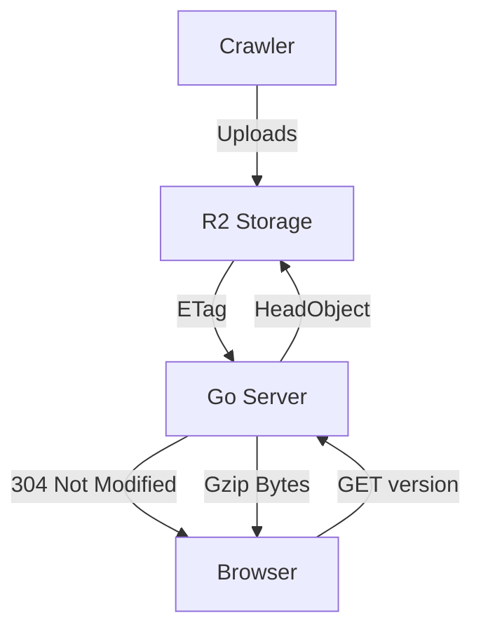

# System Architecture: Labriideas Publisher

## 1. Overview
The Labriideas Publisher is a high-performance, immutable data distribution engine. It is designed to serve large music catalogs with minimal latency and bandwidth by treating the catalog as a versioned binary asset.

## 2. High-Level Data Flow

## 2. System Logic Flow
The system operates as an "Immutable Data Proxy":

1. **Storage (Source of Truth):** Compressed catalog files (`catalog.json.gz`) are stored in Cloudflare R2.
2. **Versioning:** The R2 ETag (MD5 hash) serves as the atomic version key.
3. **Delivery:** The Go server proxies this data using an in-memory RAM cache.
4. **Handshake:** The browser sends its current ETag; if the server's ETag matches, it returns "304 Not Modified," bypassing the download.

## 3. Core Design Decisions

| Decision | Justification |
| :--- | :--- |
**Schema-Driven Design** | The system uses a central CatalogSchema definition. The Crawler and CSV tools dynamically map fields based on this source of truth, allowing for data-agnostic processing and zero-code updates when adding new track metadata fields. |
**ETag Versioning** | Uses native R2 hashes as the "Truth," eliminating file synchronization risks. |
| **Gzip Transport** | Files remain compressed from storage, through the proxy, to browser storage. |
| **Lazy Inflation** | The browser only decompresses/parses JSON when the user starts a session. |
| **Proxy Pattern** | Keeps R2 buckets private; all CORS and auth are managed by the Go layer. |
| **Background Warmup** | The Go server primes its RAM cache on startup to eliminate network cold-start latency. |

## 4. Operational Principles
- **Immutability:** Once a catalog is uploaded to R2, it is never modified.
- **Single Responsibility:** 
  - **R2:** Pure storage.
  - **Go Backend:** Authentication, caching engine, and HTTP proxy.
  - **Browser/Svelte:** UI rendering and local data inflation.
