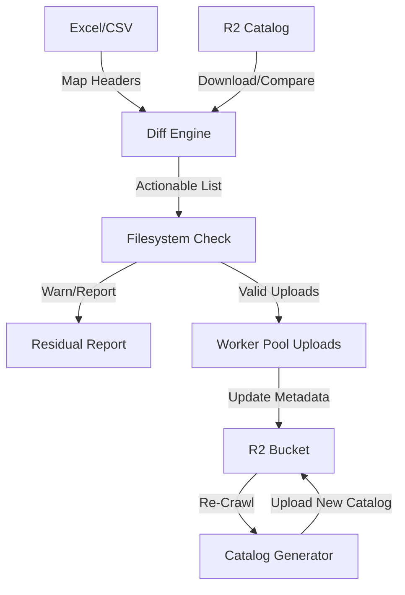

# BULK_UPLOAD_TOOL.md

## 1. Overview
The Bulk Upload Tool is a desktop utility designed to synchronize large batches of audio files and metadata. It replaces manual browser-based uploading with an automated, high-concurrency pipeline. It achieves "Source of Truth" synchronization by comparing local filesystem assets against an existing R2 catalog.

## 2. Design Principles
*   **Schema-Driven Ingestion:** The tool utilizes the global `schema.CatalogSchema`. It dynamically aligns CSV columns to the schema at runtime, ignoring extraneous data and flagging missing mandatory fields.
*   **Zero-State Server:** The tool acts as an orchestrator. No database is required; the tool uses the R2 bucket’s own `catalog.json.gz` and file metadata as the primary state.
*   **Two-Phase Execution:** To ensure safety, the tool separates the **Plan** (Diffing & Validation) from the **Execute** (Upload & Catalog Patching) phases.

## 3. Data Processing Pipeline

### Phase 1: CSV & Catalog Diffing
1.  **Header Mapping:** The tool uses an index-based CSV parser. It reads the header row and aligns columns to the `CatalogSchema` indices.
2.  **Diff Engine:** The tool compares the CSV data against the current R2 `catalog.json.gz`.
    *   **New Assets:** Files present in CSV but absent in Catalog.
    *   **Changed Metadata:** Files present in both, but where CSV fields differ from Catalog fields.
    *   **Orphaned Assets:** (Optional Reporting) Files present in Catalog but missing from CSV.

### Phase 2: Local Filesystem Verification
1.  **Selection:** The user selects a local root directory via a system file browser.
2.  **Verification:** The tool crawls the local directory for every "New Asset" identified in Phase 1.
3.  **The Residual Report:** 
    *   If a file is missing on disk, it is added to a `residual_changes.csv`. 
    *   The user is prompted with a summary: *"X files ready, Y files missing. Continue with available?"*

## 4. Workflow Diagram

## 5. High-Concurrency Upload
*   The tool utilizes a **Worker Pool** pattern. Instead of sequential uploads, it initiates multiple simultaneous worker goroutines to saturate available upload bandwidth.
*   **Atomic Updates:** Each upload creates an R2 object with embedded metadata tags.
*   **Hot Patch:** Once all files are confirmed in R2, the tool triggers the catalog reconciliation logic—rebuilding the JSON catalog and uploading it back to the R2 bucket.

## 6. CSV Ingestion Logic
The tool employs a **Flexible Reader** pattern:
- **Mandatory Field:** `filename` (Must be unique).
- **Graceful Handling:** 
    - Columns matching `CatalogSchema`: Data is mapped to the asset.
    - Missing columns in CSV: Corresponding schema fields remain null/empty.
    - Extra columns in CSV: Silently ignored to allow users to keep internal tracking notes.

## 7. Implementation Notes
- **UI Toolkit:** Built with [Fyne](https://fyne.io/) for native Windows windowing and controls.
- **Resilience:** If the process is interrupted, the catalog remains in its last known good state because the final catalog upload is the terminal action in the pipeline.
- **Integrity:** The tool calculates MD5 hashes locally before upload to match the `hash` field requirements of the `CatalogSchema`.
