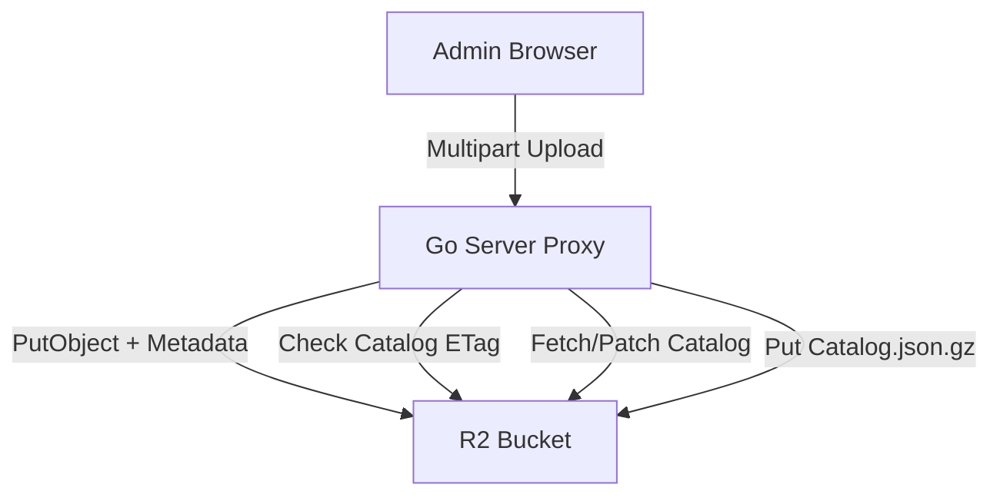

# Upload Manager Documentation

## 1. Overview
The **Upload Manager** system provides an automated pipeline to add audio assets to the R2 storage bucket. It is designed to be **schema-agnostic**, utilizing the `schema/schema.go` definition to dynamically drive the metadata input forms and the catalog structure.

## 2. Logical Data Flow
1.  **Preparation (Browser):** The `UploadManager` component calculates a client-side **MD5 hash** of the selected file to ensure integrity and prevent duplicates.
2.  **Metadata Injection:** The UI dynamically generates form fields based on the system `CatalogSchema`. 
3.  **Transport:** The file (multipart) and metadata (JSON) are sent to the Go server's `/api/upload-track` endpoint.
4.  **Storage (R2):** The Go server saves the physical MP3 to R2, embedding the custom metadata into the object’s system tags.
5.  **The "Hot Patch" (Orchestration):**
    *   To keep `catalog.json.gz` synchronized without a full system crawl, the server performs an internal **read-modify-write** operation.
    *   It checks the file's ETag hash to avoid unnecessary downloads.
    *   It appends the new track entry to the existing catalog data.
    *   It uploads the updated, compressed catalog back to R2.
    *   It clears the server RAM cache to ensure state consistency for all users.

## 3. Workflow Diagram

## 4. Function Reference

### `PutObjectWithMetadata` (Storage Client)
- **Purpose:** Uploads raw bytes to R2 while attaching user-defined key-value metadata.
- **Workflow:** Binds file content and system metadata in a single atomic R2 operation.

### `uploadTrackHandler` (Go API)
- **Purpose:** Orchestrates the multipart upload and catalog synchronization.
- **Key Features:**
    - **CORS Handling:** Manages preflight (OPTIONS) requests for `multipart/form-data`.
    - **Hash Verification:** Performs a `HeadObject` check against R2 to confirm the existing `catalog.json.gz` hash before fetching content, minimizing bandwidth.
    - **Atomic Catalog Patch:** Manages the full decompression, JSON unmarshalling, appending, re-compression, and re-upload lifecycle.

## 5. Frontend Component (`UploadManager.svelte`)
- **MD5 Calculation:** Utilizes `spark-md5` to calculate file integrity hashes locally.
- **Dynamic Forms:** Uses object iteration to map and bind inputs directly from the current metadata state.
- **Upload Feedback:** Uses `XMLHttpRequest` event listeners to provide real-time percentage-based progress feedback.

## 6. Development Notes
- **Security:** The endpoint is currently open for development convenience. Future iterations will wrap this route with JWT authentication middleware (Admin-only).
- **Statelessness:** The Go server maintains no local disk storage; all operations are performed in-memory and proxied directly to R2.

